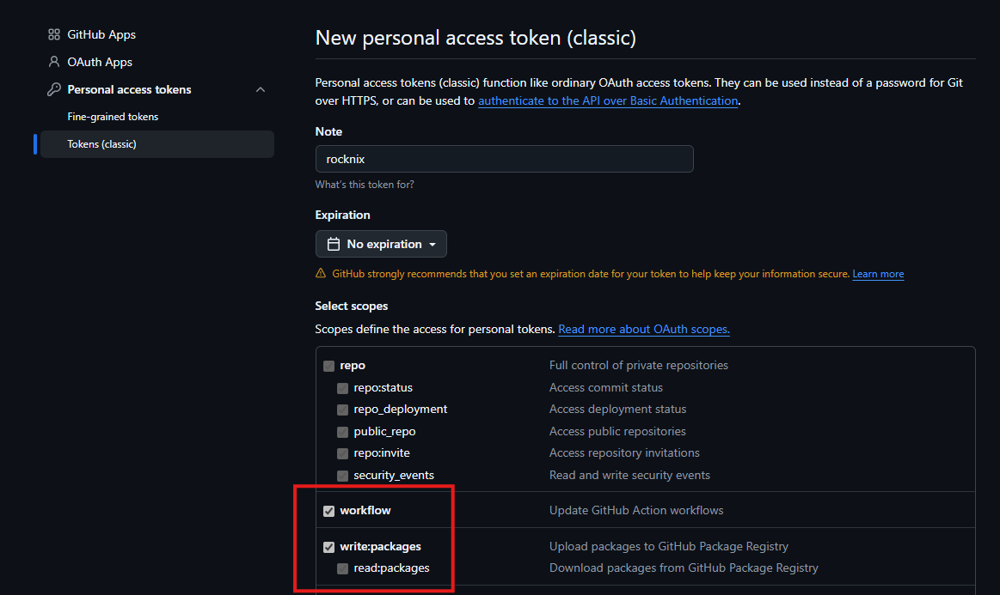
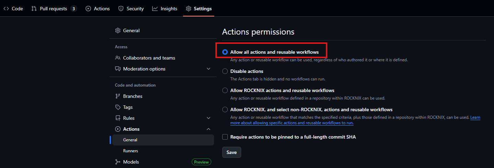
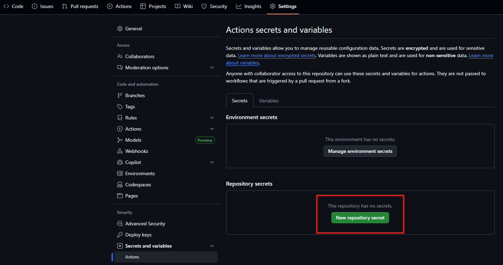
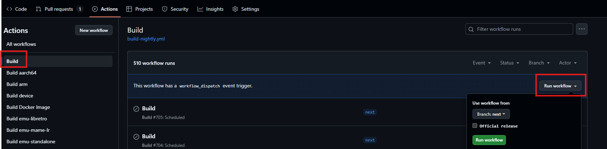

# :octicons-stack-16: Building ROCKNIX Using GitHub Runners

## 1. Fork the Repositories

Create forks of the following repositories:

- [ROCKNIX/distribution](https://github.com/ROCKNIX/distribution)  
- [ROCKNIX/distribution-cache](https://github.com/ROCKNIX/distribution-cache)

---

## 2. Create a GitHub Personal Access Token

1. Go to [https://github.com/settings/tokens](https://github.com/settings/tokens).  
2. Click **Generate new token → Generate new token (classic)**.  
3. Add a note (e.g. `rocknix`).  
4. Choose an expiration date.
5. Select the following scopes:
    - `workflow`
    - `write:packages`
6. Click **Generate token**.

!!! note  "⚠️ **Important:** Copy and securely save your newly generated token — you will need it later!"

---

## 3. Enable Actions on the `distribution` Fork

1. Go to **Settings → Actions → General**.  
2. Select **Allow all actions and reusable workflows**.  
3. Click **Save**.

---

## 4. Add an Actions Secret

1. Go to **Settings → Secrets and variables → Actions**.  
2. Click **New repository secret**.
   
3. Fill in the form as follows:
    - **Name:** `GH_PAT`
    - **Secret:** `your token from Step 2`
4. Click **Add secret**. 

---

## 5. Run the Build Action

1. Go to the **Actions** tab in your forked repository.  
2. Select the **Build** workflow.  
3. Click **Run workflow** to start the build process.

---

### ⏱️ Build Duration

!!! tip "The **first build** will take approximately **13 hours**. Subsequent builds will be significantly faster thanks to the generated **ccache**."

---

!!! note  "Once the workflow completes successfully, your ROCKNIX build artifacts will be available in the workflow run summary."
