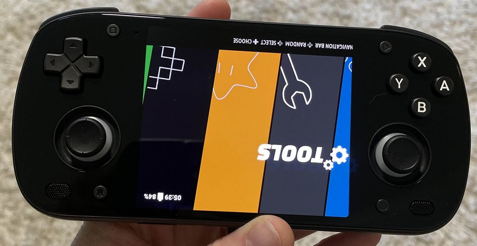

---
search:
  exclude: true
---

# Retroid Pocket Mini

{ .off-glb }

## Overview

| Device | CPU / Architecture | Kernel | GL driver | Vulkan driver | Interface |
| -- | -- | -- | -- | -- | -- |
| Retroid Pocket Mini | Qualcomm SD865 (SM8250) | Mainline Linux | Freedreno | Turnip | Sway + Emulation Station |

## Features

| Feature&nbsp;&nbsp;&nbsp;&nbsp;&nbsp;&nbsp;&nbsp;&nbsp;&nbsp;&nbsp;&nbsp;&nbsp;&nbsp;&nbsp;&nbsp;&nbsp; | Notes |
| -- | -- |
| :material-wifi: Wifi | Can be turned on in Emulation Station under Main Menu > Network Settings |
| :simple-bluetooth: Bluetooth | Supports bluetooth audio and controllers |
| :material-fan: Fan | Can be set globally, per system or per game. |
| :material-lightbulb-on: Joystick LEDS | Supports selecting from a set of colors, battery level status, <br>  or turning the joystick LEDS off. |
| :material-vibrate: Rumble | Can be turned on or off in Emulation Station under <br> Controller & Bluetooth Settings > Enable Rumble |

## Controls


















## Additional References

- [Platform Documentation (SM8250)](https://github.com/ROCKNIX/distribution/blob/main/documentation/PER_DEVICE_DOCUMENTATION/SM8250)

### Retroid Pocket Mini V2

!!! note "Retroid's Android OTA for the Pocket Mini V2 Breaks Bootloader Visibility"
    The latest OTA update from Retroid for the Pocket Mini V2 includes a faulty bootloader. 
    As a result, the GRUB boot selection screen is no longer visible at startup.

    This may result in you booting with the wrong device selection. If your screen
    looks like the following then follow the steps below.

    { .off-glb }

    #### How to Fix It
    You’ll need to manually reflash the **loader partition** using **fastboot**.

    #### Step 1: Download and extract Android SDK Platform Tools
    [SDK Platform Tools](https://developer.android.com/tools/releases/platform-tools#downloads)

    #### Step 2: Download the Fixed Bootloader to the SDK Platform Tools folder
    [Download u-boot-sm8250-retroidpocket-rpminiv2.img](https://github.com/RetroidPocket/u-boot/releases/download/rp-v1.0.1/u-boot-sm8250-retroidpocket-rpminiv2.img)

    #### Step 3: Enter ABL / Fastboot mode
    Hold **Volume Down** while powering on the device.

    #### Step 4: Flash the Loader Partition
    Open a cmd prompt and `cd` to the directory you extracted the Android SDK platform tools,
    and type the following command.
    ```
    fastboot flash loader u-boot-sm8250-retroidpocket-rpminiv2.img
    ```

    #### Step 5: Boot up and select "Retroid Pocket Mini V2" from the GRUB screen.

### Community Videos

| <iframe width="560" height="315" src="https://www.youtube.com/embed/PtZKzzWysw8?si=Zg8OB4gFO9aRG0Hb" title="YouTube video player" frameborder="0" allow="accelerometer; autoplay; clipboard-write; encrypted-media; gyroscope; picture-in-picture; web-share" referrerpolicy="strict-origin-when-cross-origin" allowfullscreen></iframe> |
